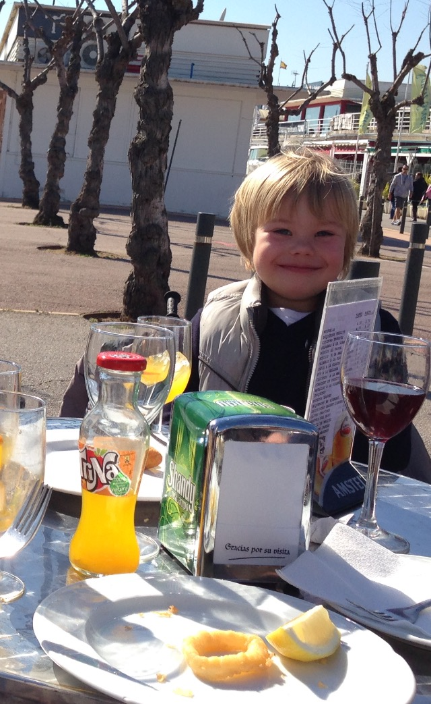
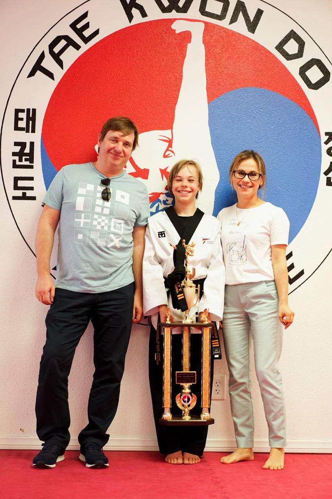
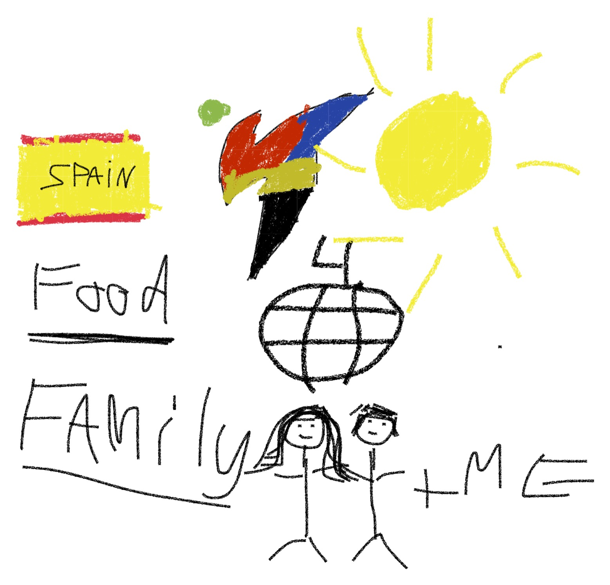

<h1>Sergi Serpukhovitinov's Page</h1>
 
<h3> All you need to know about me: </h3>
 

<h2 id="marginplus">Background:</h2>

Hi, my name is Sergi and here's a little bit about me. I was born in Mataro, Spain on July 12, 2008. I am an only child and I don’t have any pets. My mom’s name is Anna, and my dad’s name is Eugene. Both my mom and dad were born in Russia, yet, met each other in Spain after they immigrated by themselves at a young age! I lived in Spain for over 10 years and recently moved to the U.S. in 2018. Some fun facts about me: I speak four languages, do Taekwondo professionally and I LOVE eating and playing games. I will eat just about anything you name (if it’s edible). Some of my hobbies are: fishing, sports, games, hanging out with friends, and attempting to learn new things. Stay tuned for more posts about me! 

